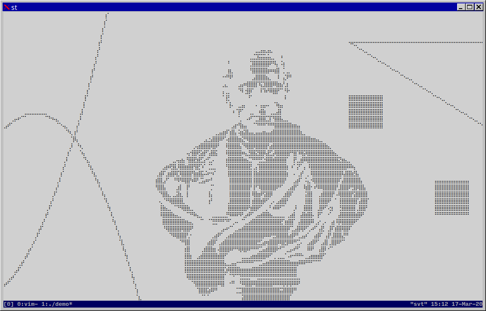

louis
=====

This little graphics library uses Unicode braille characters to draw points,
lines, rectangles, curves, and two-value bitmaps to a VT100 terminal emulator.
It could be used for simple games or for mathematical visualization programs. I
intend to expand on the library of geometrical functions.

